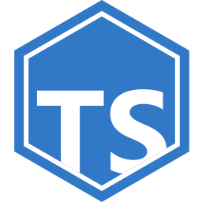

<div align="center">
  

# kirby-types

A collection of TypeScript types for [Kirby CMS](https://getkirby.com).

[Panel types](#panel-types) •
[Backend API types](#backend-types) •
[Block and layout types](#layouts)

</div>

## Setup

```bash
# pnpm
pnpm add -D kirby-types

# npm
npm i -D kirby-types

# yarn
yarn add -D kirby-types
```

## Features

<table>
<tr>
<th>🪟 Panel Types</th>
<th>🔌 Backend Types</th>
</tr>
<tr>
<td>

- **Panel API**: Complete API client method types.
- **State Management**: State, Feature, and Modal hierarchies.
- **Features**: Views, dialogs, drawers, notifications, uploads, and more.
- **Helpers**: Array, string, object, URL, and other utility types.
- **Libraries**: Color manipulation, dayjs, and autosize types.
- **Writer**: ProseMirror-based rich text editor utilities.

</td>
<td>

- **API Response**: Type-safe API responses.
- **Blocks**: All 11 default block types with content structures.
- **Layouts**: Layout and column types with width unions.
- **KQL**: Query Language request/response types.
- **Query Parsing**: Parse query strings into structured objects at the type level.

</td>
</tr>
</table>

## Basic Usage

### Panel Types

Type the global `window.panel` object for Panel plugin development:

```ts
import type { Panel } from "kirby-types";

// Augment the global Window interface
declare global {
  interface Window {
    panel: Panel;
  }
}

// Now window.panel is fully typed
window.panel.notification.success("Page saved!");
window.panel.dialog.open("pages/create");
```

Common Panel operations with full type safety:

```ts
// Notifications
window.panel.notification.success("Changes saved");
window.panel.notification.error("Something went wrong");

// Theme
window.panel.theme.set("dark");
const currentTheme = window.panel.theme.current; // "light" | "dark"

// Navigation
await window.panel.view.open("/pages/blog");
await window.panel.dialog.open("/dialogs/pages/create");

// API calls
const page = await window.panel.api.pages.read("blog");
await window.panel.api.pages.update("blog", { title: "New Title" });

// Content state
const hasChanges = window.panel.content.hasChanges;
await window.panel.content.save();

// User info
const user = window.panel.user;
console.log(user.email, user.role);
```

### API Responses

```ts
import type { KirbyApiResponse } from "kirby-types";

interface PageData {
  id: string;
  title: string;
  url: string;
}

const response: KirbyApiResponse<PageData> = {
  code: 200,
  status: "ok",
  result: {
    id: "home",
    title: "Home",
    url: "/",
  },
};
```

### Blocks

```ts
import type { KirbyBlock, KirbyDefaultBlockType } from "kirby-types";

// Using a default block type
const textBlock: KirbyBlock<"text"> = {
  id: "abc123",
  type: "text",
  isHidden: false,
  content: { text: "Hello world" },
};

// Using a custom block type
interface HeroContent {
  title: string;
  image: string;
  cta: string;
}

const heroBlock: KirbyBlock<"hero", HeroContent> = {
  id: "def456",
  type: "hero",
  isHidden: false,
  content: {
    title: "Welcome",
    image: "hero.jpg",
    cta: "Learn more",
  },
};
```

### Layouts

```ts
import type { KirbyLayout, KirbyLayoutColumn } from "kirby-types";

const layout: KirbyLayout = {
  id: "layout-xyz789",
  attrs: { class: "highlight" },
  columns: [
    { id: "col-1", width: "1/3", blocks: [] },
    { id: "col-2", width: "2/3", blocks: [] },
  ],
};
```

### KQL Queries

```ts
import type {
  KirbyQuery,
  KirbyQueryRequest,
  KirbyQueryResponse,
} from "kirby-types";

// KQL request with pagination
const request: KirbyQueryRequest = {
  query: 'page("blog").children.listed',
  select: {
    title: "page.title",
    date: "page.date.toDate",
  },
  pagination: { limit: 10 },
};

// Typed response
interface BlogPost {
  title: string;
  date: string;
}

const response: KirbyQueryResponse<BlogPost[], true> = {
  code: 200,
  status: "ok",
  result: {
    data: [{ title: "Post 1", date: "2024-01-01" }],
    pagination: { page: 1, pages: 5, offset: 0, limit: 10, total: 50 },
  },
};
```

### Query Parsing

Parse query strings into structured objects at the type level:

```ts
import type { ParseKirbyQuery } from "kirby-types";

type Parsed = ParseKirbyQuery<'page.children.filterBy("status", "published")'>;
// Result: {
//   model: "page";
//   chain: [
//     { type: "property"; name: "children" },
//     { type: "method"; name: "filterBy"; params: '"status", "published"' }
//   ]
// }
```

### Writer Extensions

For ProseMirror-based Writer extensions (requires optional ProseMirror peer dependencies):

```ts
import type { WriterMarkContext } from "kirby-types";

// In a Writer mark extension
class Bold {
  commands({ type, utils }: WriterMarkContext) {
    return () => utils.toggleMark(type);
  }

  inputRules({ type, utils }: WriterMarkContext) {
    return [utils.markInputRule(/\*\*([^*]+)\*\*$/, type)];
  }
}
```

## API Reference

### Panel

| Type                                         | Description                         |
| -------------------------------------------- | ----------------------------------- |
| [`Panel`](./src/panel/index.d.ts)            | Main Panel interface                |
| [`PanelApi`](./src/panel/api.d.ts)           | API client methods                  |
| [`PanelState`](./src/panel/base.d.ts)        | Base state interface                |
| [`PanelFeature`](./src/panel/base.d.ts)      | Feature with loading states         |
| [`PanelModal`](./src/panel/base.d.ts)        | Modal (dialog/drawer) interface     |
| [`PanelHelpers`](./src/panel/helpers.d.ts)   | Utility functions                   |
| [`PanelLibrary`](./src/panel/libraries.d.ts) | Libraries (colors, dayjs, autosize) |

### Writer

| Type                                                | Description                        |
| --------------------------------------------------- | ---------------------------------- |
| [`WriterUtils`](./src/panel/writer.d.ts)            | ProseMirror commands and utilities |
| [`WriterMarkContext`](./src/panel/writer.d.ts)      | Context for mark extensions        |
| [`WriterNodeContext`](./src/panel/writer.d.ts)      | Context for node extensions        |
| [`WriterExtensionContext`](./src/panel/writer.d.ts) | Context for generic extensions     |

### API

| Type                                    | Description                           |
| --------------------------------------- | ------------------------------------- |
| [`KirbyApiResponse<T>`](./src/api.d.ts) | Standard Kirby API response structure |

### Blocks

| Type                                         | Description                       |
| -------------------------------------------- | --------------------------------- |
| [`KirbyBlock<T, U>`](./src/blocks.d.ts)      | Block with type and content       |
| [`KirbyCodeLanguage`](./src/blocks.d.ts)     | Valid code block languages        |
| [`KirbyDefaultBlocks`](./src/blocks.d.ts)    | Default block content types       |
| [`KirbyDefaultBlockType`](./src/blocks.d.ts) | Union of default block type names |

### Layouts

| Type                                          | Description                  |
| --------------------------------------------- | ---------------------------- |
| [`KirbyLayout`](./src/layout.d.ts)            | Layout row with columns      |
| [`KirbyLayoutColumn`](./src/layout.d.ts)      | Column with width and blocks |
| [`KirbyLayoutColumnWidth`](./src/layout.d.ts) | Valid column width fractions |

### KQL

| Type                                         | Description                           |
| -------------------------------------------- | ------------------------------------- |
| [`KirbyQuerySchema`](./src/kql.d.ts)         | KQL query schema structure            |
| [`KirbyQueryRequest`](./src/kql.d.ts)        | KQL request with pagination           |
| [`KirbyQueryResponse<T, P>`](./src/kql.d.ts) | KQL response with optional pagination |

### Query

| Type                                     | Description                           |
| ---------------------------------------- | ------------------------------------- |
| [`KirbyQuery<M>`](./src/query.d.ts)      | Valid KQL query string                |
| [`KirbyQueryModel<M>`](./src/query.d.ts) | Supported query models                |
| [`KirbyQueryChain<M>`](./src/query.d.ts) | Query chain patterns                  |
| [`ParseKirbyQuery<T>`](./src/query.d.ts) | Parse query string to structured type |

## Optional Dependencies

The Panel types include Writer types that require ProseMirror packages. These are optional peer dependencies:

```bash
# Only needed if using Writer extension types
pnpm add -D prosemirror-commands prosemirror-inputrules prosemirror-model prosemirror-schema-list prosemirror-state
```

Vue is also an optional peer dependency for Panel types:

```bash
pnpm add -D vue@^2.7.0
```

## License

[MIT](./LICENSE) License © 2022-PRESENT [Johann Schopplich](https://github.com/johannschopplich)
